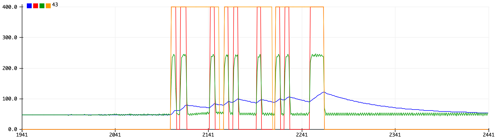

# Smartphone screen to LED communication

A toy project demonstrating how any LED can be used to receive data from an arbitrary light source such as a smartphone screen while still maintaining its regular *light emitting* functionality. Try it out using the [transmitter app](https://carlfriess.github.io/LED_Receiver/).

This is interesting in that it shows that any device with an LED and a microcontroller is capable of communicating with other devices without additional hardware. For example, some toy or gadget without any other communication interface could be configured using a smartphone via its existing status LED.

The Arduino code measures the amount of light hitting the LED by regularly reverse-biasing the LED. The transmitter app encodes characters and transmits them by flashing the screen using a very simple sequence similar to RS232. Once the Arduino detects the initial start bit of each character, it attempts to receive a full character and checks the included parity bit. Using two different byte values as start and end of packet markers, the Arduino queues all bytes belonging to a packet and writes out the full packet over Serial if no transmission errors were detected throughout the packet.

This sketch was developed and tested on an Arduino Uno (ATmega328P) but may work on other Arduino boards. Connect an LED to the Arduino (anode pin A1 - cathode pin A0). Your milage will vary depending on the LED used and ambient lighting conditions.

Setting the `DEBUG` preprocessor macro to `1` will make the Arduino output additional data that can be conveniently plotted using the Arduino Serial Plotter. Below is a trace showing the sequence of characters `ABC`. The green line is the current measured light level, the blue line is a low-pass filtered version of the measured light level, the red line shows the estimation of if the current bit is 0 or 1 and the orange line shows the computed character boundaries.

